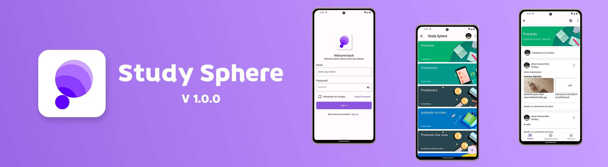

## Sobre el Proyecto

El proyecto trata de una plataforma de educación en línea completa, que cubra todas las partes necesarias para el proceso educativo. Plataforma para consultar el material educativo, realización de apuntes y ejercicios e incluso chats con compañeros de clase.

## Tecnologias

El proyecto consta de dos partes el backend y el frontend. Para el backend estoy usando NestJs que es un framework de JavaScript que permite la creación de backend escalables y rapidos. Y para la parte del frontend Estoy usando Flutter un sdk de google que permite crear aplicaciones multiplataforma.

### Backend

### Caracteristicas

-  📶 **WebSockets**: Uso de tecnologia WebSocket Para chat en tiempo real.
- 📧 **Email**: Envio de emails a los usuarios para notificarles de cualquier asunto.
- 🏃 **Velocidad**: Al usar NestJs como backend ofrecemos un backend con una velocidad de respuesta muy alta.
- 😎 **Autenticación**: Rutas protegidas por **JWToken**.
- 🗞️ **Push Notification**: Cada vez que un usuario inicia sesión en un dispositivo nuevo, se almacena el token del dispositivo para poder mandar notificaciones a todos los dispositivos en los que el usuario tenga su cuenta.
- 🌍 **Escalabilidad**: El backend sigue una estructura bien definida y gracias al usar Nest Js permite que el backend pueda escalar sin ningún problema.
- 📄 **Postgres SQL**: Una de las bases de datos relaciones más usadas en la actualidad, con muchisima escalabilidad y muy buen rendimiento.
- ⚠️ **Manejo de Errores**: Uso de _Class Validators_ para el manejo de datos de entrada y salida.
- 🖼️ **Subida de Archivos**: Permite subida de archivos que posteriormente serán almacenados en un bucket de firebase para garantizar la seguridad y privacidad de los fichero.
- 🛠️ **Prisma ORM**: Uso de Prisma ORM, uno de los mejores ORM en la actualidad que permite tener mayor control y facilidad de las consultas y relaciones de nuestra base de datos postgres

### Frontend

#### Caracteristicas

- ⛩️ **Arquitectura limpia**: el proyecto está hecho siguiendo una arquitectura limpia para que sea más escalable y facíl de mantener.
- 🔒 **Almacenaminto seguro**: Cifrado de token para almacenarlo en las preferencias de usuario de una manera segura.
- 🔌 **Provider**: Uso de Provider como manejador de estado, recomendado por el equipo de flutter y escalable.
- 🗞️ **Push Notification**: Notificaciones push gracias a firebase y nuestro backend.

